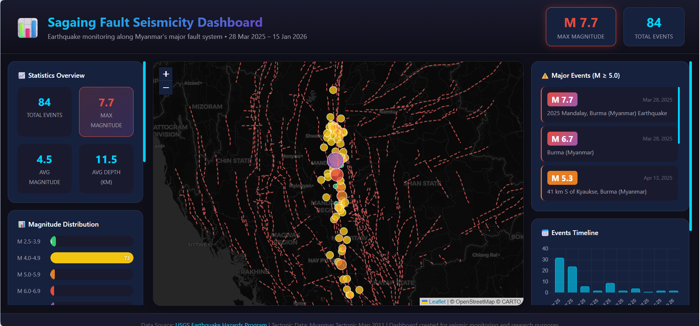

# 🌍 Sagaing Fault Seismicity Dashboard

An interactive web dashboard for visualizing earthquake activity along Myanmar's Sagaing Fault system. This dashboard displays seismic events from **March 28, 2025 to January 15, 2026**, including the devastating M 7.7 Mandalay earthquake.



## 📊 Features

### Interactive Map
- **Leaflet.js-powered map** with multiple basemap options (Dark, Satellite, Terrain, Light)
- **Circle markers** for each earthquake, sized and colored by magnitude
- **Tectonic lineaments** overlay showing fault lines from Myanmar Tectonic Map 2011
- **Click-to-zoom** functionality for major events
- **Popup information** displaying earthquake details (magnitude, location, time, depth)

### Statistics Panel
- Total earthquake events count
- Maximum magnitude recorded
- Average magnitude
- Average depth (km)

### Magnitude Distribution
- Visual bar chart showing event counts across magnitude ranges:
  - M 2.5-3.9 (Minor)
  - M 4.0-4.9 (Light)
  - M 5.0-5.9 (Moderate)
  - M 6.0-6.9 (Strong)
  - M 7.0+ (Major)

### Interactive Controls
- **Magnitude Filter**: Slider to filter earthquakes by minimum magnitude
- **Layer Toggles**: Show/hide earthquake markers and tectonic lineaments
- **Basemap Selector**: Switch between different map styles

### Charts & Visualizations
- **Events Timeline**: Monthly bar chart showing earthquake frequency
- **Magnitude Over Time**: Scatter plot displaying magnitude distribution over time

### Major Events List
- Scrollable list of significant earthquakes (M ≥ 5.0)
- Click any event to fly to its location on the map
- Color-coded by severity (orange for M 5.0-5.9, red gradient for M 6.0+)

## 🚀 Quick Start

### Option 1: Open Directly
Simply open `index.html` in a modern web browser. Note: Some features may be limited due to CORS restrictions.

### Option 2: Local Development Server (Recommended)
```bash
# Using Python
python -m http.server 8080

# Using Node.js
npx http-server -p 8080

# Using PHP
php -S localhost:8080
```
Then navigate to `http://localhost:8080` in your browser.

### Option 3: GitHub Pages
This project is ready for deployment on GitHub Pages. Simply enable GitHub Pages in your repository settings and select the main branch.

## 📁 Project Structure

```
sagaing-fault-dashboard/
├── index.html          # Main HTML structure
├── styles.css          # Complete styling with dark theme
├── app.js              # JavaScript application logic
├── query.json          # Earthquake data (GeoJSON format)
├── README.md           # This file
├── LICENSE             # MIT License
└── docs/
    └── dashboard-preview.png
```

## 📈 Data Sources

### Earthquake Data
- **Source**: [USGS Earthquake Hazards Program](https://earthquake.usgs.gov/)
- **Format**: GeoJSON (FeatureCollection)
- **Coverage**: March 28, 2025 – January 15, 2026
- **Region**: Sagaing Fault area, Myanmar
- **Minimum Magnitude**: 2.5
- **Total Events**: 181

### Tectonic Data
- **Source**: [Myanmar Tectonic Map 2011](https://raw.githubusercontent.com/drtinkooo/myanmar-earthquake-archive/main/Myanmar_Tectonic_Map_2011.geojson)
- **Format**: GeoJSON
- **Features**: Fault lines and tectonic lineaments

## 🔧 Technologies Used

| Technology | Purpose |
|------------|---------|
| HTML5 | Structure and layout |
| CSS3 | Styling with CSS variables and responsive design |
| JavaScript (ES6+) | Application logic and interactivity |
| [Leaflet.js](https://leafletjs.com/) | Interactive mapping |
| [Chart.js](https://www.chartjs.org/) | Data visualization (charts) |
| [chartjs-adapter-date-fns](https://github.com/chartjs/chartjs-adapter-date-fns) | Date handling for Chart.js |

### External Tile Providers
- **Dark/Light**: CARTO
- **Satellite**: Esri World Imagery
- **Terrain**: OpenTopoMap

## 🎨 Design Features

- **Dark Theme**: Modern dark color scheme optimized for data visualization
- **Responsive Layout**: Three-column grid adapts to different screen sizes
- **Smooth Animations**: Hover effects, transitions, and micro-interactions
- **Gradient Accents**: Cyan-to-purple gradient theme
- **Custom Scrollbars**: Styled scrollbars for panel sections

## 📊 Notable Earthquakes in Dataset

| Date | Magnitude | Location |
|------|-----------|----------|
| March 28, 2025 | **M 7.7** | Mandalay, Burma (Myanmar) |
| March 28, 2025 | M 6.7 | Burma (Myanmar) |
| April 13, 2025 | M 5.3 | 41 km S of Kyaukse |
| May 17, 2025 | M 5.1 | 22 km SSW of Kyaukse |
| July 19, 2025 | M 5.1 | 28 km ENE of Shwebo |

## 🌐 Browser Compatibility

- ✅ Chrome (recommended)
- ✅ Firefox
- ✅ Safari
- ✅ Edge
- ⚠️ Internet Explorer (not supported)

## 📝 License

This project is licensed under the MIT License - see the [LICENSE](LICENSE) file for details.

## 🙏 Acknowledgments

- [USGS Earthquake Hazards Program](https://earthquake.usgs.gov/) for earthquake data
- [Leaflet](https://leafletjs.com/) for the mapping library
- [Chart.js](https://www.chartjs.org/) for charting capabilities
- Myanmar Tectonic Map 2011 contributors for fault line data

## 👤 Author

Created for seismic monitoring and research purposes.

---

**⚠️ Disclaimer**: This dashboard is for educational and research purposes. For official earthquake information, please refer to the USGS or your local seismological authority.
